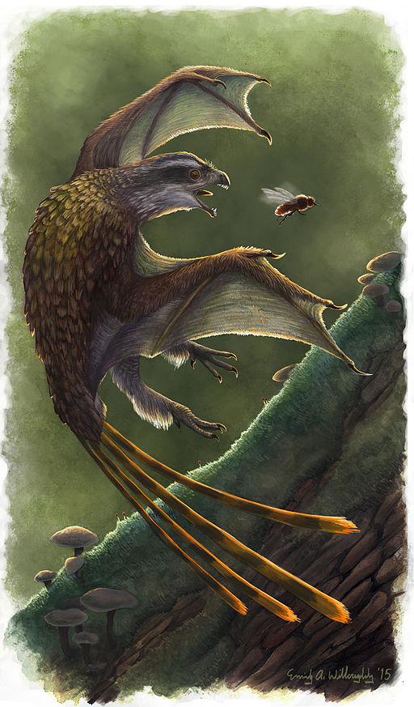

```{r setup, include=FALSE}
knitr::opts_chunk$set(echo = FALSE)
```


Artist representation of Yi Qi, a scansoriopterygian dinosaur, by Emily Willoughby  
License: Emily Willoughby, (e.deinonychus@gmail.com, [emilywilloughby.com](https://emilywilloughby.com) ), CC BY-SA 4.0, via Wikimedia Commons  
Link to the [image](https://commons.wikimedia.org/wiki/File:Yi_qi_restoration.jpg?uselang=fr) 

## I - SOURCE OF THE ARTICLE WITH PUBLICATION DATE AND WORD COUNT:
__Source of the article:__ [(Michael Le Page, 2020)](https://www.newscientist.com/article/2257732-the-first-flying-dinosaurs-were-a-failed-evolutionary-experiment/)

__Word count:__ 418


__Source of the study:__ [(T. Alexander Dececchi *et al.*, 2020)](https://doi.org/10.1016/j.isci.2020.101574)


## II - VOCABULARY

| English      | Definition / Synonym                | French        |
|--------------|-------------------------------------|---------------|
| bat          | nocturnal flying mammal             | chauve-souris |
| failed       | unsuccessful                        | raté          |
| (to) fly     | move through the air                | voler         |
| glider       | a person or thing that glides       | planeur       |
| nocturnal    | active at night                     | nocturne      |
| outcompeted  | got less successful than            | surpassé      |
| partly       | not completely                      | partiellement |
| pterosaur    | prehistoric flying reptile          | ptérosaure    |
| rather than  | in preference to                    | plutôt que    |
| several      | a few                               | plusieurs     |
| shaped       | having shape of                     | en forme de   |
| squeezed out | exclude, push out                   | écarté        |
| wings        | organs of flight of certain animals | ailes         |

*Note: these translations were mainly possible thanks to Wordreference*

## III - ANALYSIS TABLE ABOUT THE STUDY

* **Researchers?**
    + T. Alexander Dececchi
    + Arindam Roy
    + Michael Pittman
    + Thomas G. Kaye
    + Xing Xu
    + Michael B. Habib
    + Hans C.E. Larsson
    + Xiaoli Wang
    + Xiaoting Zheng

* **Published in?**
    + October 22, 2020


* **General topic**
    + Flight abilities of scansoriopterygidae

* **Procedure/what was examined**
    + Testing the flight potential of “membrane-winged” scansoriopterygian dinosaurs using laser-stimulated fluorescence imaging

* **Conclusions/discovery**
    + The studied dinosaurs (Scansoriopterygidae):
        - were probably arboreal
        - probably didn't have access to powered flight
        - had limited gliding abilities
        - are not the base for the way modern birds fly
        - had different wings compared to their contemporaneous paravians, which supports the thesis of various independent origins of flight

* **Remaining questions**
    + None
