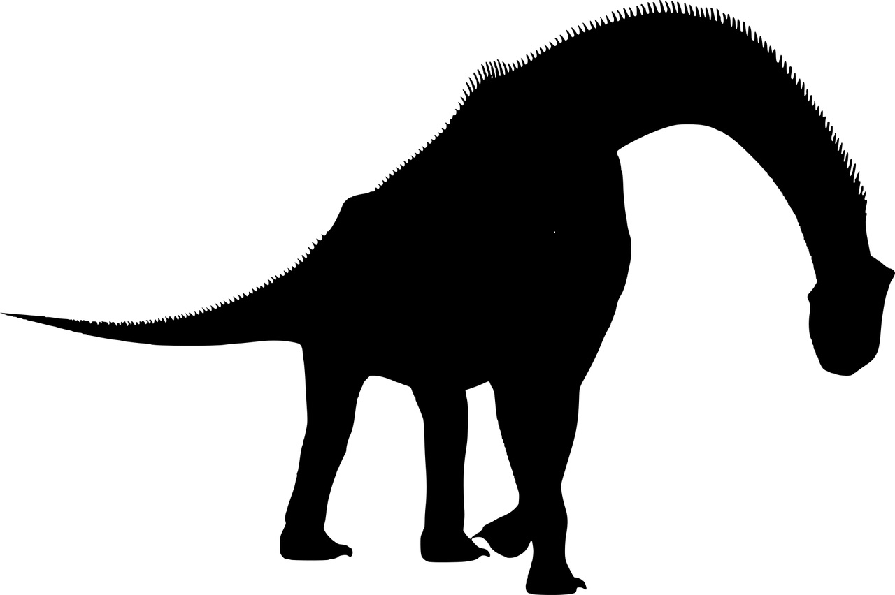

```{r setup, include=FALSE}
knitr::opts_chunk$set(echo = FALSE)
```


[Source of the image](https://pixabay.com/fr/vectors/silhouette-dinosaure-brachiosaurus-3464840/)

## I - SOURCE OF THE ARTICLE WITH PUBLICATION DATE AND WORD COUNT:
__Source of the article:__ [(Michael Marshall, 2020)](https://www.newscientist.com/article/2253205-best-preserved-titanosaur-embryo-reveals-they-had-nose-horns-as-babies/)

__Word count:__ 406


__Source of the study:__ [(Martin Kundrát *et al.*, 2020)](https://www.cell.com/current-biology/fulltext/S0960-9822(20)31150-7?_returnURL=https%3A%2F%2Flinkinghub.elsevier.com%2Fretrieve%2Fpii%2FS0960982220311507%3Fshowall%3Dtrue)

## II - VOCABULARY

| English      | Definition / Synonym                | French          |
|--------------|-------------------------------------|-----------------|
| bulk         | largeness                           | volume          |
| eggshell     | outer part of the egg               | coquille d'oeuf |
| embryo       | Fertilized eggs, early foetus       | embryon         |
| enclosed     | surrounded                          | clos            |
| forward      | towards the front                   | vers l'avant    |
| freelance    | self-employed                       | indépendant     |
| horn         | bony protrusion on animal's head    | corne           |
| neck         | top of the spine                    | cou             |
| neither      | not either one                      | aucun           |
| sauropods    | clade of saurischian dinosaurs      | sauropodes      |
| sheer        | alone, by itself                    | pur             |
| skull        | bone of the head                    | crâne           |
| snout        | animal's nose                       | museau          |
| titanosaur   | biological group of sauropods       | titanosaure     |


*Note: these translations were mainly possible thanks to Wordreference*

## III - ANALYSIS TABLE ABOUT THE STUDY

* **Researchers?**
    + Martin Kundrát
    + Rodolfo A. Coria
    + Terry W. Manning
    + Daniel Snitting
    + Luis M. Chiappe
    + John Nudds
    + Per E. Ahlberg

* **Published in?**
    + August 27, 2020
    
* **General topic**
    + Dinosaurs

* **Procedure/what was examined**
    + Analysis of a well-preserved embryonic skull of a titanosaur

* **Conclusions/discovery**
    + The studied fossil:
        - had "advanced ossifications of the snout", highly suggesting the presence of a horn for young titanosaurs
        - used the calcium from their egg-shell very early in their embryonic development 
        - has orbits that face anterolaterally, presumably granting the juveniles binocular vision
    + The horn could have been used for defense and in order to pierce effectively the eggshell when they hatched

* **Remaining questions**
    + None
