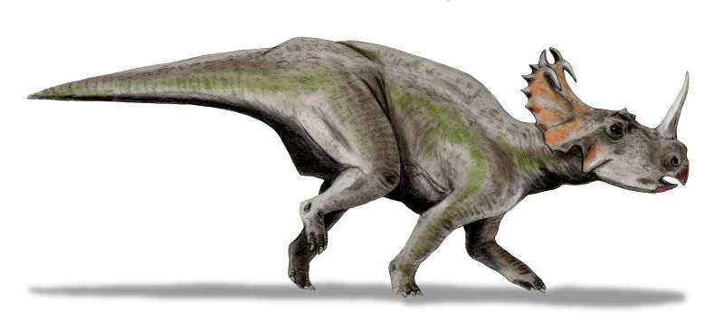

```{r setup, include=FALSE}
knitr::opts_chunk$set(echo = FALSE)
```

Artist vision of a Centrosaurus, by Nobu Tamura (http://spinops.blogspot.com) — Personal work, CC BY 3.0   [Source](https://commons.wikimedia.org/w/index.php?curid=19459817)

## I - SOURCE OF THE ARTICLE WITH PUBLICATION DATE AND WORD COUNT:
__Source of the article:__ [Royal Ontario Museum. "Malignant cancer diagnosed in a dinosaur for the first time." ScienceDaily. ScienceDaily, 3 August 2020](https://www.sciencedaily.com/releases/2020/08/200803184149.htm)

__Word count:__ 661


__Source of the study:__ [(Seper Ekhtiari *et al.*, 2020)](https://www.sciencedirect.com/science/article/pii/S1470204520301716)

## II - VOCABULARY

| English             | Definition / Synonym                    | French                  |
|---------------------|-----------------------------------------|-------------------------|
| (to) aim            | (to) attempt                            | viser                   |
| (to) assess         | (to) determine                          | évaluer                 |
| (to) cast           | (to) mould                              | mouler                  |
| crippling           | with very serious, harmful effect       | handicapant, paralysant |
| devastating         | very harmful or damaging                | dévastateur             |
| evidence            | proof                                   | preuve                  |
| fibula              | outer bone in the lower part of the leg | péroné                  |
| fracture            | slight crack or break in a bone         | fracture                |
| herd                | large group of animals of one kind      | troupeau                |
| horn                | bony protrusion on animal's head        | corne                   |
| lung                | organ in the chest used to breathe      | poumon                  |
| osteopathologist    | physician who studies osteopathology    | ostéopathe              |
| (to be) struck down | (to be) hit by                          | être frappé par         |
| tomography          | technique giving a 3D model of something| tomographie             |
| unmistakable        | unequivocal                             | indubitable             |


*Note: these translations were mainly possible thanks to Reverso Dictionary*

## III - ANALYSIS TABLE ABOUT THE STUDY

* **Researchers?**
    + Seper Ekhtiari
    + Kentaro Chiba
    + Snezana Popovic
    + Rhianne Crowther
    + Gregory Wohl
    + Andy Kin On Wong
    + Darren H Tanke
    + Danielle M Dufault
    + Olivia D Geen
    + Naveen Parasu
    + Mark A Crowther
    +David C Evans

* **Published in?**
    + August 3, 2020
    
* **General topic**
    + Dinosaurs
    + Paleontology
    + Osteopathology

* **Procedure/what was examined**
    + Analysis of a damaged fibula of a *Centrosaurus apertus*, using:
        - radiographic and hystological analysis
        - musculoskeletal oncology and human pathology experts
        - comparisons with a normal fibula from *Centrosaurus apertus*
        - comparisons with a human fibula with an advanced osteosarcoma
        - a careful rejection of other diagnoses

* **Conclusions/discovery**
    + The fibula is the first confirmed case of osteosarcoma in a dinosaur in the history of paleontology

* **Remaining questions**
    + None
