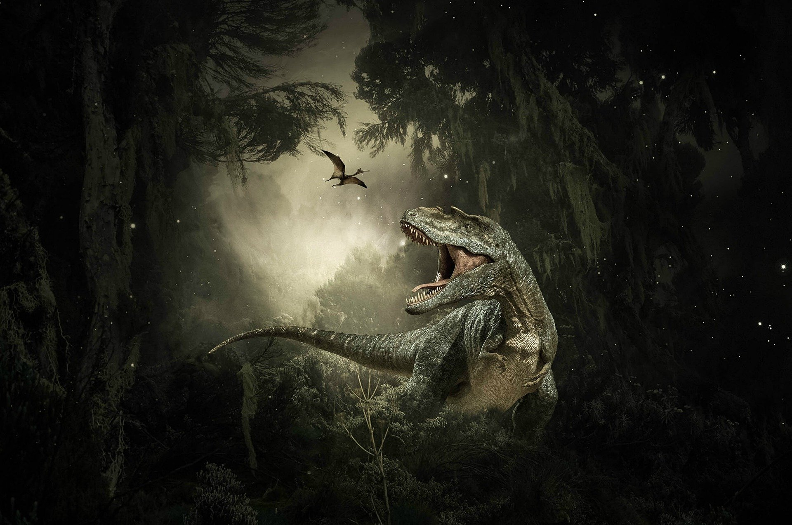

```{r setup, include=FALSE}
knitr::opts_chunk$set(echo = FALSE)
```


Image by <a href="https://pixabay.com/users/willgard-4665627/?utm_source=link-attribution&amp;utm_medium=referral&amp;utm_campaign=image&amp;utm_content=5687815">Willgard Krause</a> from <a href="https://pixabay.com/?utm_source=link-attribution&amp;utm_medium=referral&amp;utm_campaign=image&amp;utm_content=5687815">Pixabay</a>

## I - SOURCE OF THE ARTICLE WITH PUBLICATION DATE AND WORD COUNT:
__Source of the article:__ [(ISSAM AHMED, 2021)](https://www.sciencealert.com/teenage-t-rex-edged-out-smaller-dinosaur-species-says-study)

__Word count:__ 530


__Source of the study:__ [(Katlin Schroeder *et al.*, 2021)](https://science.sciencemag.org/content/371/6532/941)


## II - VOCABULARY

| English              | Definition / Synonym                | French                     |
|----------------------|-------------------------------------|----------------------------|
| enduring             | lasting                             | tenace                     |
| (to) flourish        | (to) prosper, (to) develop well     | prospérer, se développer   |
| hatchling            | baby bird (here: baby dinosaur)     | oisillon                   |
| juvenile             | young                               | jeune                      |
| longstanding         | well-established, long-term         | de longue date             |
| Offspring            | young of an animal                  | progéniture                |
| otherwise            | or else                             | sinon, autrement, sans quoi|
| (to) outcompete      | (to) be more successful than        | surpasser, supplanter      |
| (to) prey (on sth)   | (to) hunt as food                   | chasser une proie          |
| (to) reshape (sth)   | (to) shape differently              | refaçonner                 |
| (to) shift           | (to) move, (to) transit             | déplacer, transiter        |
| shopping mall        | shopping centre	                   | centre commercial          |
| towards              | in the direction of                 | vers                       |
| towering             | very tall                           | imposant, immense          |

*Note: these translations were mainly possible thanks to Wordreference*

## III - ANALYSIS TABLE ABOUT THE STUDY

* **Researchers?**
    + Katlin Schroeder
    + S. Kathleen Lyons
    + Felisa A. Smith


* **Published in?**
    + Feb 26, 2021


* **General topic**
    + The impact of young megatheropods on the amont of middle-sized carnivorous dinosaurs

* **Procedure/what was examined**
    + Application of a statistical analysis on the recorded fossils of carnivorous dinosaurs all around the world to compare their body size distribution to the one of the present predators

* **Conclusions/discovery**
    + Although the size of dinosaurs drastically increased between the Jurassic and the Cretaceous period, the gap between small and big carnivores was constant
    + Young megatheropods seemed to have played the role of middle-sized carnivores, leaving no available niche for middle-sized carnivores to thrive in
    + The conclusions above seem to apply to all continents

* **Remaining questions**
    + None

