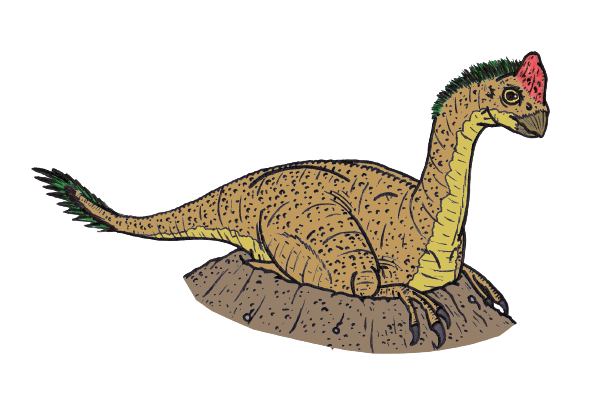

```{r setup, include=FALSE}
knitr::opts_chunk$set(echo = FALSE)
```

Artist impression of an Oviraptorid guarding its nest, by &lt;a href=&quot;//commons.wikimedia.org/wiki/User:Conty&quot; title=&quot;User:Conty&quot;&gt;Conty&lt;/a&gt; - &lt;span class=&quot;int-own-work&quot; lang=&quot;en&quot;&gt;Own work&lt;/span&gt;, Public Domain, <a href="https://commons.wikimedia.org/w/index.php?curid=6556432">Link</a>

## I - SOURCE OF THE ARTICLE WITH PUBLICATION DATE AND WORD COUNT:
__Source of the article:__ [(CARLY CASSELLA, 2021)](https://www.sciencealert.com/fossilized-dinosaur-found-brooding-on-a-nest-of-preserved-eggs-with-actual-embryos-inside)

__Word count:__ 794


__Source of the study:__ [(Shundong Bi *et al.*, 2020)](https://doi.org/10.1016/j.scib.2020.12.018)


## II - VOCABULARY

| English              | Definition / Synonym                | French                     |
|----------------------|-------------------------------------|----------------------------|
| (to) brood (sth)     | (to) sit on eggs                    | couver                     |
| clutch               | eggs laid                           | couvée                     |
| consistent (with sth)| fitting a diagnosis or explanation  | cohérent, concordant       |
| curled               | having a wavy or spiral shape       | recourbé                   |
| (to) deal with (sth) | address, resolve                    | s'occuper de, se charger de|
| diet                 | what you eat                        | régime alimentaire         |
| glimpse              | brief sight                         | un aperçu                  |
| (to) hatch           | animals from eggs                   | éclore                     |
| ilium (pl: ilia)     | pelvic bone                         | os iliaque                 |
| (to) infer           | (to) deduce                         | déduire                    |
| (to) lay             | (to) produce eggs                   | pondre                     |
| nest                 | bird's home (here: dino's home)     | nid                        |
| (to) nurture         | care for, raise: children           | élever                     |
| ostrich              | large bird                          | autruche                   |
| (to) unearth         | (to) dig from the ground            | déterrer                   |

*Note: these translations were mainly possible thanks to Wordreference*

## III - ANALYSIS TABLE ABOUT THE STUDY

* **Researchers?**
    + Shundong Bi
    + Romain Amiot
    + Claire Peyre de Fabrègues
    + Michael Pittman
    + Matthew C. Lamanna
    + Yilun Yu
    + Congyu Yu
    + Tzuruei Yang
    + Shukang Zhang
    + Qi Zhao
    + Xing Xu


* **Published in?**
    + 16 December 2020


* **General topic**
    + The discovery of a very complete fossil of a nest of oviraptorid, containing multiple eggs with embryos and the adult specimen on it

* **Procedure/what was examined**
    + Specimen LDNHMF2008: it is an incomplete fossil of an oviraptorid, guarding at least 24 eggs, some of which containing embryonic bones
        - histological analysis of the bones, using a polarized light microscope
        - phylogenetic analysis based on two different dataset from other studies
        - isotopic analysis of the embroynic bones, analysing their oxygen insotope composition with an isotope ratio mass spectrometer

* **Conclusions/discovery**

    + The individual on top of the eggs was an adult, probably a male. If it is the case, it would prove that oviraptoridae had paternal care
    + The specimen was an oviraptoridae
    + The incubation temperature of the eggs was between 30°C for the lower eggs and 38°C for the upper eggs
    + Since some eggs were close to hatching, this kind of oviraptoridae was protecting its eggs until they hatched
    + The eggs probably would not have hatched at the same time, which was possibly the case for most non-avialan theropods
    
* **Remaining questions**
    + It is not excluded that the specimen on top of the eggs was a female
    + Although the eggs would not have hatched at the same time, it is possible that it was due to an unknown problem and thus was not the general rule
